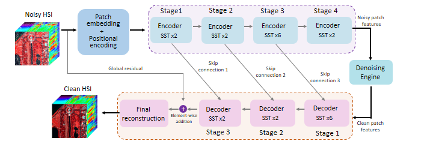

<!--
Credits and references used in this README:

1) Layout ideas and section inspiration:
   https://github.com/abhisheknaiidu/awesome-github-profile-readme?tab=readme-ov-file#descriptive-

2) Skill icons (SVG badges):
   https://github.com/tandpfun/skill-icons?tab=readme-ov-file#icons-list

3) GitHub stats card:
   https://github.com/anuraghazra/github-readme-stats
-->

# Welcome to my profile!

## About Me
- Machine learning enthusiast, actively trying to learn the core advancements of ML.
- Focused at designing and deploying technical solutions using deep learning models and methods.
- Interested at combining latest research findings with existing ML methods for smarter and more optimized applications.
  

## Skill stack
<!-- Skill icons provided by skill-icons. Full icon list and names:
     https://github.com/tandpfun/skill-icons?tab=readme-ov-file#icons-list -->
<!-- -->

**Also comfortable with**: React, Flutter, MATLAB and basic machine learning workflows.

---

## Projects - showcase

<table>
  <tr>
     <td align="center" width="33%">
      
       
      <b>HSI denoising web interface</b> 
      Deployed the custom hyperspectral image denoising model via a web application, displaying the distorted image beside the cleaned image. 
      🔗 <a href="https://github.com/muhtasim-ishmum-khan/HSI_denoising_interface/tree/main">Repo</a>
       
    </td>
    <td align="center" width="33%">
      
       
      <b>HSI Denoising Project</b> 
      Developed a fully automated model that uses deep learning and transformers to clean hyperspectral images having multiple types
         of distortions and makes the images reusable. 
      🔗 <a href="https://github.com/muhtasim-ishmum-khan/HSI_denoising">Repo</a>
       
    </td>
    <td align="center" width="33%">
      
       
      <b>Deep Learning Project on MRI-dataset</b> 
      Developed a custom CNN model which is lighter and performs on par with other pretrained models at classifying brain tumours from MRI scan images. 
      🔗 <a href="https://github.com/muhtasim-ishmum-khan/DL_project_CSE465">Repo</a>
       
    </td>
  </tr>
</table>

---

## Links

<!-- Optional: fun GIF. Consider replacing with contribution streak or removing for a tighter, more professional finish. -->

